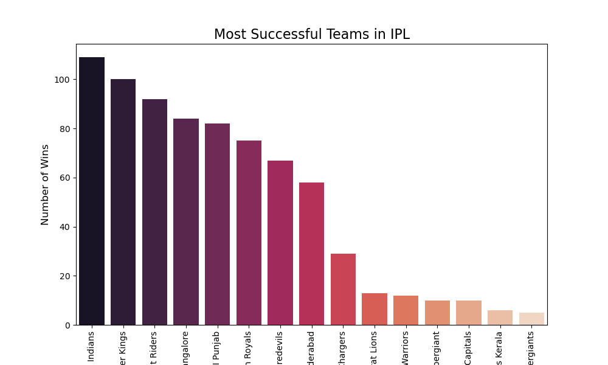
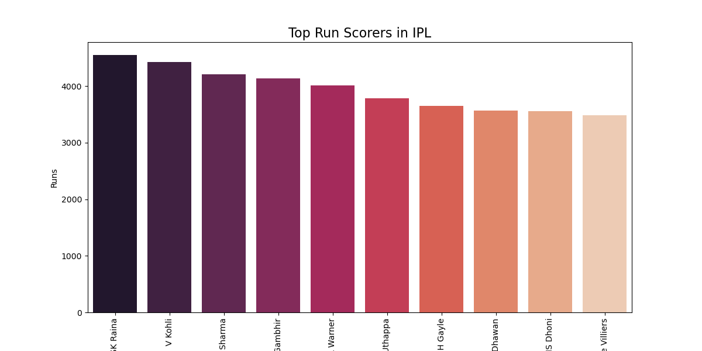
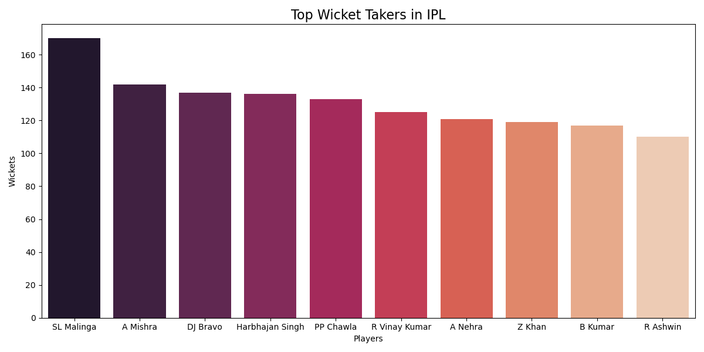
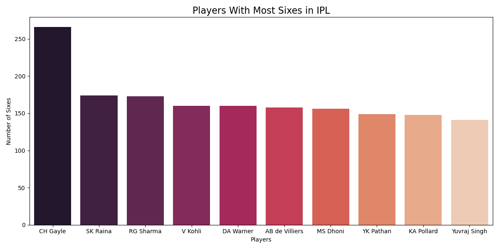
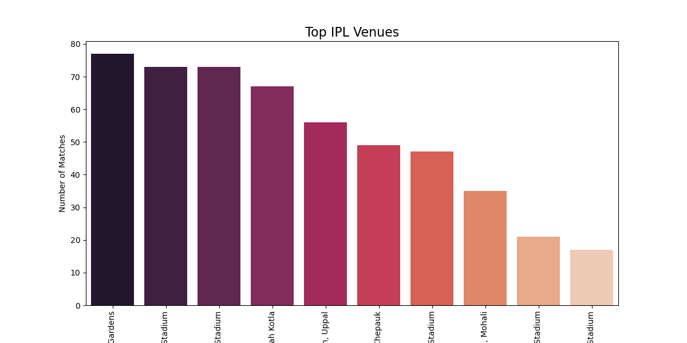
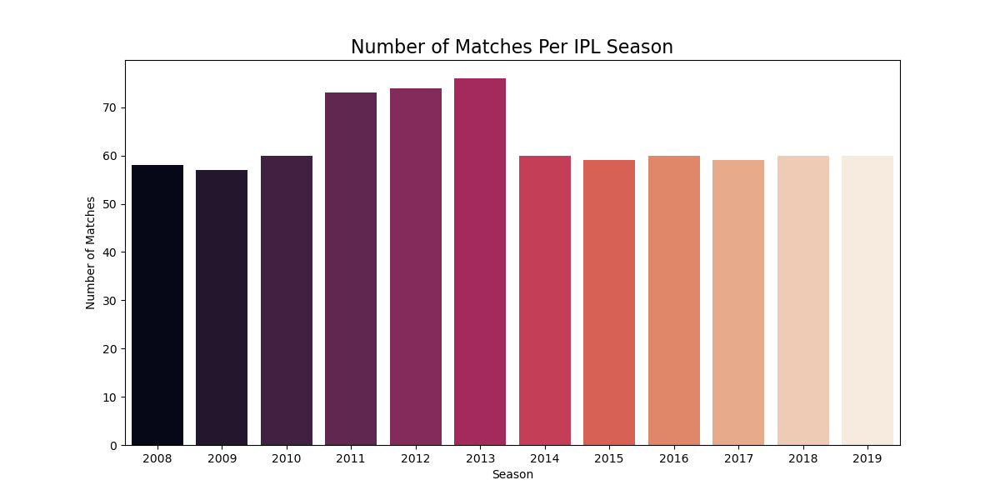

# IPL Data Analysis Project 🏏

## Overview
This project performs Exploratory Data Analysis (EDA) on IPL (Indian Premier League) datasets using Python.  
The analysis focuses on team performances, batting records, bowling records, venue statistics, toss impact, and season-wise IPL trends.

The project was built using Jupyter Notebook and various Python data analysis libraries.

---

## Technologies Used

- Python
- Pandas
- Matplotlib
- Seaborn
- Jupyter Notebook
- Git & GitHub

---

## Project Structure

```bash
IPL-Data-Analysis/
│
├── data/
│   ├── deliveries.csv
│   └── matches.csv
│
├── output/
│   ├── season_matches.png
│   ├── team_wins.png
│   ├── top_batsmen.png
│   ├── top_bowlers.png
│   ├── top_six_hitters.png
│   └── top_venues.png
│
├── ipl_analysis.ipynb
├── README.md
├── requirements.txt
└── .gitignore
```

---

## Analysis Performed

### 📌 Most Successful IPL Teams
Analyzed the teams with the highest number of wins in IPL history.

### 📌 Toss Impact Analysis
Studied whether winning the toss provides an advantage in match outcomes.

### 📌 Top Run Scorers
Identified the highest run scorers in IPL history.

### 📌 Top Wicket Takers
Analyzed bowlers with the highest number of wickets.

### 📌 Players With Most Sixes
Explored the most aggressive batsmen based on six-hitting statistics.

### 📌 Venue Analysis
Analyzed stadiums that hosted the most IPL matches.

### 📌 Season-wise Trends
Studied how the number of IPL matches changed over different seasons.

---

## Sample Visualizations

### Most Successful IPL Teams


### Top Run Scorers


### Top Wicket Takers


### Players With Most Sixes


### Top IPL Venues


### Season-wise IPL Matches


---

## Key Insights

- Mumbai Indians and Chennai Super Kings are among the most successful IPL franchises.
- Winning the toss provides a slight advantage in IPL matches.
- Suresh Raina and Virat Kohli are among the leading run scorers.
- Lasith Malinga is one of the highest wicket takers in the dataset.
- Chris Gayle dominates six-hitting statistics.
- Eden Gardens has hosted the highest number of IPL matches.

---

## Learning Outcomes

Through this project, I improved my understanding of:

- Data Cleaning
- Exploratory Data Analysis (EDA)
- Data Visualization
- GroupBy & Aggregation
- Working with real-world datasets
- Git & GitHub workflow

---

## Author

**Sujay Pandit**

---